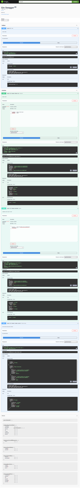

# Way2Win.ru Golang Interview Assignment

Develop an API for tracking user presence in conference rooms using Golang.

## Details

We have users with a guaranteed unique id who can check-in to any conference room with their unique id.
The check-in has an expiration date.
Once the term expires, the user should no longer be listed as a member of the room.
The user will make requests to update the “presence” in the room.
When requesting a presence update, the user can optionally specify an expiration time, otherwise the time is five minutes.
Need to develop http api
Entpoints:

- For user check-in.
- To update the user's presence in the room with an optional field for a custom expiration date.
- To get a list of rooms and their users.

## How to run

1. Create a file called ".env" in the root folder. Same level as .gitignore and docker-compose.yml.
2. Copy the template from `.env.example`
3. In your terminal run the command: `docker compose -f "docker-compose.yml" up -d --build`

## Technologies

I used the technologies highlghted in the assignment description, namely Python and Aiogram.

1. Golang (A trendy, highly perfomant modern programming language used for writing high output servers and developer tools.)
2. Gin (A stable and mature, ultra fast, light weight web framework for Golang)
3. Postgres DB (The industry standard for a SQl database)
4. Docker (A tool for containerizing software projects)

## Improvements

The task is an interview assignment, it is not a production ready application. Here are some of the things that can be done.

1. Write unit tests using
2. Write a CI/CD pipeline
3. Use a self hosted Postgres database
4. Add middleware for the bots own security since write now everyone can be a user and manipulate the data.

I hope and trust that this project demonstrates my good grasp of the Golang programming language.

Warm regards,

Mike Zinyoni (4+ Years of Golang Programming experience. (Wow!!!))
